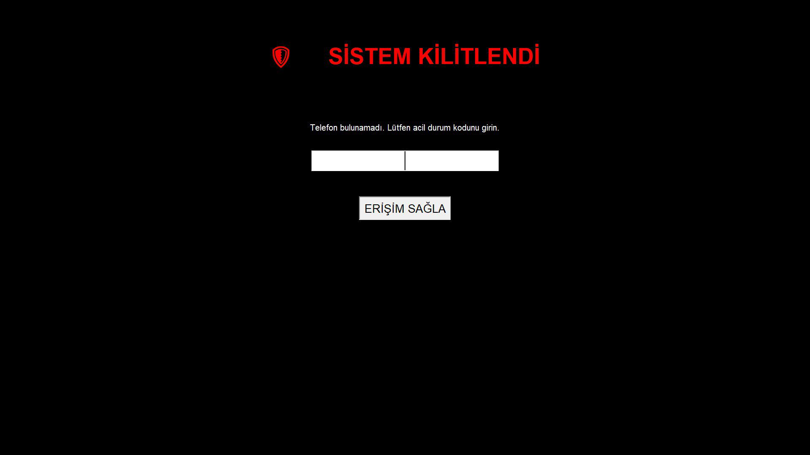

# 🛡️ Sentinel Secure Core

Bu proje, belirlediğiniz bir telefonun Wi-Fi ağından ayrılması veya bilgisayarınıza bir Uzak Masaüstü (RDP) bağlantısı yapılması durumunda Windows oturumunuzu kilitleyen ve Telegram üzerinden size bildirim gönderen bir güvenlik aracıdır.



## ✨ Özellikler

- **Telefon Menzil Kontrolü:** Belirtilen IP adresine sahip telefon ağdan koptuğunda sistemi kilitler.
- **RDP Tespiti:** Aktif bir Uzak Masaüstü bağlantısı algıladığında sistemi anında kilitler.
- **Telegram Bildirimleri:** Sistem kilitlendiğinde anında Telegram üzerinden OTP (Tek Kullanımlık Şifre) gönderir.
- **Ekran Görüntüsü:** Yanlış şifre girildiğinde ekran görüntüsü alıp Telegram ile gönderir.
- **Siren Bombardımanı:** Çok sayıda yanlış deneme veya şüpheli bağlantı durumunda Telegram üzerinden dikkat çekici bildirimler göndererek acil durum uyarısı yapar.
- **Güvenli Konfigürasyon:** Hassas bilgiler (Bot Token, Chat ID, IP) koddan ayrı bir `.env` dosyasında saklanır.

## 🚀 Kurulum

1.  **Projeyi klonlayın veya indirin:**
    ```bash
    git clone <repository-url>
    cd KORUMA
    ```

2.  **Gerekli kütüphaneleri yükleyin:**
    (Bir sanal ortam oluşturmanız tavsiye edilir.)
    ```bash
    pip install -r requirements.txt
    ```

3.  **Ortam değişkenlerini ayarlayın:**
    Proje ana dizininde `.env` adında bir dosya oluşturun ve aşağıdaki gibi doldurun.

    ```env
    # Telefonunuzun yerel ağdaki STATİK IP adresi
    PHONE_IP="192.168.1.XX"

    # Telegram Bot'unuzun Token'ı
    BOT_TOKEN="****************************"

    # Telegram Bot'un mesaj göndereceği sizin Chat ID'niz
    CHAT_ID="telegram_chat_id"
    ```
    > **Not:** Telefonunuzun IP adresinin sabit (statik) olması önemlidir. Modem arayüzünden MAC adresine göre IP ataması yapabilirsiniz.

## 🏃‍♂️ Çalıştırma

Script'i başlatmak için aşağıdaki komutu kullanabilirsiniz. Arka planda sessizce çalışacaktır.
```bash
python koruma.pyw
```

## ⚠️ Sorumluluk Reddi
Bu araç güvenlik amaçlı geliştirilmiştir. Kullanımından doğacak herhangi bir sorumluluk kullanıcıya aittir. Hassas bilgilerinizi (`.env` dosyası) kimseyle paylaşmadığınızdan emin olun.